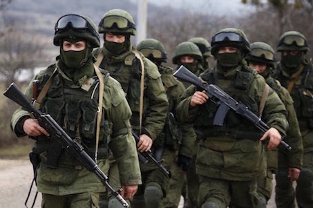

---
output:
  html_document: 
    theme: readable
---

```{r, include=FALSE}

library("rio")
library("gdata")
library("mlogit")
library("dplyr")
library("car")
library("Hmisc")
library("ggplot2")
library("nnet")
library("memisc")
library("stargazer")
library("png")
CIMI_Dataset <- rio::import("https://raw.githubusercontent.com/KatrinHeger/CollaborativeResearchProject/master/Data_Gathering/CIMI.csv")
NSA_Dataset <- rio::import("http://privatewww.essex.ac.uk/~ksg/data/nsa_v3.4_21November2013.asc", format = "tsv")
Cleaned_CIMI <- subset(CIMI_Dataset, select = c(1, 2, 3, 4, 6, 7, 8, 9, 10, 20, 21, 22, 23, 24, 25))
colnames(Cleaned_CIMI)[colnames(Cleaned_CIMI)=="outcome_d"] <- "conflict_outcome"
colnames(Cleaned_CIMI)[colnames(Cleaned_CIMI)=="land"] <- "secessionist"
Cleaned_CIMI <- Cleaned_CIMI[!is.na(Cleaned_CIMI$conflict_outcome),]
Cleaned_NSA <- subset(NSA_Dataset, select = c(3, 7, 8, 14, 27, 32, 33, 35, 36))
Cleaned_NSA <- Cleaned_NSA[!is.na(Cleaned_NSA$rebel.support),]
Cleaned_NSA <- Cleaned_NSA[!is.na(Cleaned_NSA$gov.support),]
Cleaned_NSA$rebel.support_d <- recode(Cleaned_NSA$rebel.support, " 'explicit' = 1;'no' = 0;'alleged' = 0 ")
Cleaned_NSA$gov.support_d <- recode(Cleaned_NSA$gov.support, " 'explicit' = 1;'no' = 0;'alleged' = 0 ")
Cleaned_NSA$rebpolwinglegal_d <- recode(Cleaned_NSA$rebpolwinglegal, " 'yes' = 1; 'no' = 0 ")
Cleaned_NSA$rebel.support_d=as.factor(Cleaned_NSA$rebel.support_d)
Cleaned_NSA$gov.support_d=as.factor(Cleaned_NSA$rebel.support_d)
Cleaned_NSA$rtypesup <- gsub(';', '', Cleaned_NSA$rtypesup)
Cleaned_NSA$rtypesup[Cleaned_NSA$rtypesup == 'endorsement alleged military'] <- NA
Cleaned_NSA <- Cleaned_NSA[!is.na(Cleaned_NSA$rtypesup),]
Cleaned_NSA <- Cleaned_NSA[!is.na(Cleaned_NSA$gtypesup),]
Cleaned_NSA$rtypesup_cat <- recode(Cleaned_NSA$rtypesup, " 'troops' = 1; 'military' = 2; 'non-military' = 3 ")
Cleaned_NSA$gtypesup_cat <- recode(Cleaned_NSA$gtypesup, " 'troops' = 1; 'military' = 2; 'non-military' = 3 ")
Cleaned_NSA$rtypesup_cat=as.factor(Cleaned_NSA$rtypesup_cat)
Cleaned_NSA$gtypesup_cat=as.factor(Cleaned_NSA$gtypesup_cat)
Cleaned_CIMI <- rename(Cleaned_CIMI, dyad_id = "dyadid")
Dataset_1 <- merge(x = Cleaned_CIMI, y= Cleaned_NSA, by = "dyadid" , all = TRUE)
Dataset_1 <- dplyr::select(Dataset_1, -postCW.1)
Dataset_1$gov.vic.dummy <- recode(Dataset_1$conflict_outcome, " '3' = 1; '0' = 0; '1' = 0; '2' = 0 ")
Dataset_1$reb.vic.dummy <- recode(Dataset_1$conflict_outcome, " '1' = 1; '0' = 0; '2' = 0; '3' = 0 ")
Dataset_1$settle.dummy <- recode(Dataset_1$conflict_outcome, " '2' = 1; '0' = 0; '1' = 0; '3' = 0 ")
Dataset_1$low.act.dummy <- recode(Dataset_1$conflict_outcome, " '0' = 1; '1' = 0; '2' = 0; '3' = 0 ")
Dataset_1$fightcaphigh <- factor(Dataset_1$fightcaphigh)
Dataset_1_gtype_HG <- Dataset_1[!is.na(Dataset_1$gtypesup_cat),]
Dataset_1_rtype_HG <- Dataset_1[!is.na(Dataset_1$gtypesup_cat),]

```

# Third-Party Intervention in Intrastate War 
### Do outcomes match intentions?

**Katrin Heger and Benedikt Abendroth**

*Hertie School of Governance, Berlin (GER)*


### Motivation

After the end of the Cold War there was optimism that the number of conflicts would decrease, but this hope was dashed with the emergence of numerous intrastate conflicts in Europe, Africa, and Asia. The world seems far from being in peace with conflicts raging in Iraq, Syria, Ukraine, Yemen, South Sudan and the DR Congo. Delivering money, weapons, and training to conflict zones has become a convenient solution for many Western states, not wanting to do the dirty work themselves. Sending military equipment and other supplies constitutes a middle ground between being a passive bystander and sending troops. In Syria, the US provided weapons to the rebels fighting the autocratic Assad regime, and in Ukraine, the pro-government forces have received arms in order to fight the separatist movement. These policies are based on rather little knowledge about the concrete impacts of third-party intervention.

[Syrian Rebel using a modern weapon](http://bit.ly/1Ow4hRV)   |  [Russian Troops in Syria](http://bit.ly/1P8n0rn)
:-------------------------:|:-------------------------:
 |  


### Goal

Our research is examining how different types of interventions in support of either the rebels or the government affect the outcome of a conflict.


### Intervention Types

The following charts illustrate the distribution of support types and conflict outcomes for 169 conflict units covering the years 1975 to 2009. We differentiate between 1) troops, 2) military and 3) non-military support to either the government or the rebels. Military support includes goods, such as weapons and tanks, whereas non-military support captures more fungible things, such as money. 

```{r, two_plots_same_size_side_by_side, header=FALSE, echo=FALSE, dpi=65}
qplot(Dataset_1_gtype_HG$gtypesup_cat, geom = "histogram", binwidth = 1, main = "Government Support Types", xlab = "Support Types", ylab = "Frequency", alpha = I(.9), fill = I("lightgreen")) + 
scale_x_discrete(breaks = 1:3, labels=c("Troops","Military","Non-military")) +
xlab(NULL)
qplot(Dataset_1_rtype_HG$rtypesup_cat, geom = "histogram", main = "Frequency of Rebel Support Types", xlab = "Support Types", ylab = "Frequency", alpha = I(.9), fill = I("brown")) + 
scale_x_discrete(breaks = 1:3, labels=c("Troops","Military","Non-military")) +
xlab(NULL)
```


### Conflict Outcomes

As illustrated below, most conflicts end up with low activity (less than 25 battle field related deaths per year). However, negotiated settlements and government victories each occur approx. twice as often as rebel victories. 

```{r fig.width=5, fig.height=4, echo=FALSE, message=FALSE, fig.align='center'}
qplot(Dataset_1$conflict_outcome, geom = "histogram", binwidth = .5, main = "Conflict Outcomes", xlab = "Outcome Types (see below)", ylab = "Frequency", fill = I("lightblue"))
```

<center>*0: Low Activity*, *1: Rebel Victory*, *2: Negotiated Settlement*, *3: Government Victory*</center>


### Approach
For our analysis we use a publicly available dataset created by [Sullivan P. and Karreth J.](http://bit.ly/1NUGi2E). They both draw from a dataset from [Cunningham D.](http://bit.ly/1ZdqZFV), as well as the University of Uppsala Conflict Data Program's (UCDP) [Conflict Termination Dataset](http://bit.ly/1QiI5zh) and [External Support Dataset](http://bit.ly/1mpfehB). For the purpose of our analysis, we add additional variables, which leaves us with 497 conflict dyad spells over a period of time from 1946 to 2010. We apply a regression design to assess the relationship between conflict outcome as our dependent variable and the support types as explanatory variables.


### Top insights

+   **We didn't find any impact of the type of government intervention on conflict outcome.**
+   **The only factor that seems to play a significant role is the type of conflict.**
+   **In a secessionist conflict, such as in Syria for instance, the rebels are more likely to prevail.**
+   **The longer the conflict, the less likely it is for the government to win.**


### Further Information and Contact

Click [here](https://github.com/KatrinHeger/CollaborativeResearchProject/raw/master/FinalPaper/FinalPaper_Markdown.pdf) to download the full paper and [here](https://github.com/KatrinHeger/CollaborativeResearchProject) to view our reproducible data on Github. The code created with the R Programming language can be found [here](https://github.com/KatrinHeger/CollaborativeResearchProject/blob/master/FinalPaper/Final_Code.R).

**Email:**

Katrin Heger: <kheger@mpp.hertie-school.org>

Benedikt Abendroth: <beaben@mpp.hertie-school.org>

*This website was last updated on December 17, 2015*